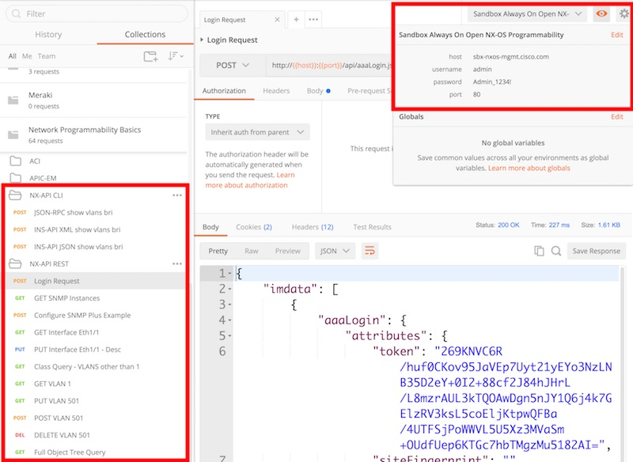

# Open NX-OS Sandbox NX-API REST Programmability Samples 

In this folder you will find a POSTMAN Environment and Collection file that you can import into Postman on your workstation to have a set of NX-API CLI and REST examples to start with.  

